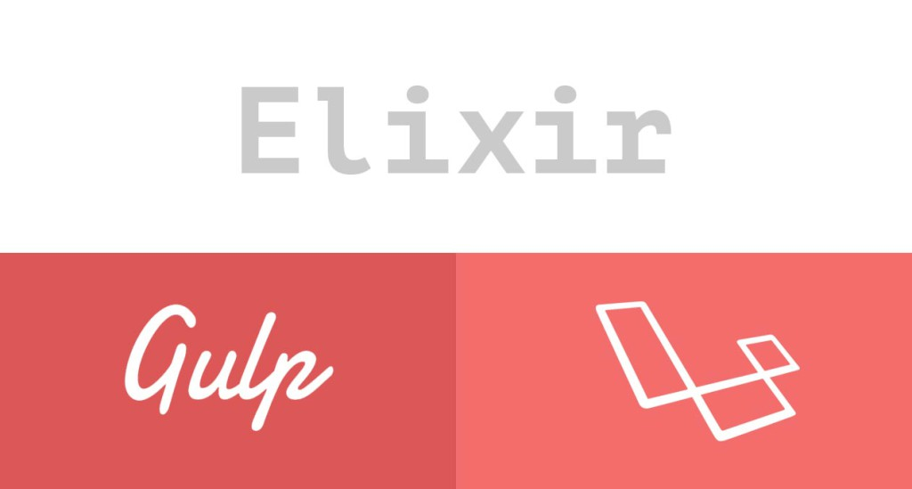

## About Laravel Elixir with laravel

Resource Planner is a resource based project management portal.
## How to do?

 - copy the package.json and gulpfile.js file
 - configure elixir.config.assetsPath for gulp source
 - configure elixir.config.publicPath for compiled files
 - for other elixir gulp stuff refer official link
 https://laravel.com/docs/5.3/elixir
